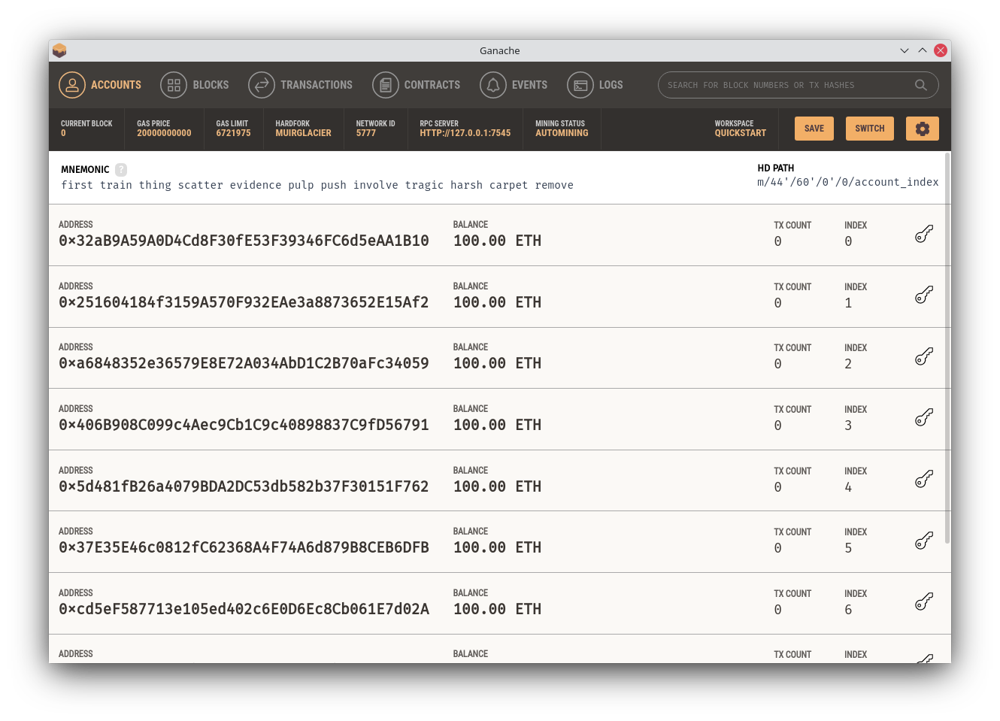
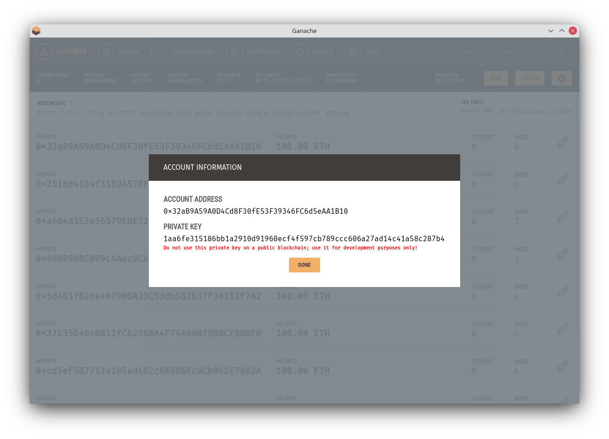

# Prerequisites

+ A method of running a private ethereum blockchain with the api listening at `http://localhost:7545`. It is recommended to use ganache by trufflesuite for setting this up. More information can be found at https://www.trufflesuite.com/ganache.
+ Docker and docker-compose must be installed. Docker is used to run the IPFS-Cluster where the file contents are saved. Information for installing docker can be found at https://docs.docker.com/get-docker/.
+ An up to date version of python 3 must be installed in order to use the vcs client. Python 3.8+ should work however if in doubt then python 3.9.4 is the version that was used to develop it and definitely works.
+ The required python packages. These are part of the Client program and are listed in requirements.txt. They can be installed with the following command: `pip install -r requirements.txt`
+ Solidity compiler. The output from compiling the smart contract code is provided inside ./Contracts/target/ however if you wish to build the source code yourself then the appropriate solidity compiler must be installed. version 0.8.4 will definitely work however any 0.8.* should not cause any issues. Information about installing solidity can be found from the documentation at https://docs.soliditylang.org/en/v0.8.4/installing-solidity.html.
+ In order to be able to merge conflicts in files, the diff3 command (part of diffutils) is used, and therefore must be installed as a dependancy.

# Setup

Before using the client both a private ethereum blockchain should be started as well as a private ipfs cluster.

The ipfs cluster can be started using the following command inside the IPFS-Cluster directory  
```bash
$ docker-compose up --build
```

When using the ganache gui program using the quickstart workspace with the defaults should be sufficent. Once it has started the quickspace workshop you should be met with the following window showing a list of already setup accounts: 

Clicking the key symbol on the far right side brings up a window showing the address of an account as well as its private key. Retrieving the private key will become important later and it should go without saying that these private keys should only be used for testing and nothing else. Clicking on the key symbol should look like the following: 

# Using the client program

./Client/main.py is the entry point for the python client program. It is important to note that with the way it has been coded it expects to be able to access the Repository.bin and Repository.abi files inside ./Contracts/target/ .

For the following examples a new directory called testing has been created to handle the repository that is created, and that the client program is invoked using the relative path `../Client/main.py`. It is also marked as executable so it can be directly executed for brevity.

Similar to how git has a .git directory which signifies the root of the repository and contains important metadata such as the remote information, this version control system has a file at the root of the repository called `.repodata.json`. Whenever you are running a command you must be running it in the same directory as the `.repodata.json`. The 2 exceptions to this rule being the init command and the clone command, which are 2 commands which will initially create this file.

When running any of the following commands the program will require the private key of the account you wish to use. By default it will prompt you to enter the private key using a password style prompt. In order to make it easier to use it will instead use the `VCS_PRIVATE_KEY` environment variable as the private key if it has been set. It can be set once and used repeatedly using the following command:
```bash
$ export VCS_PRIVATE_KEY=<privatekey-hex>
```

Creating a new remote repository (to be done inside the testing directory):
```bash
$ ../Client/main.py init <repo-name>
```

You can check the success of creating a new repository by looking for the existence of the hidden file `.repodata.json`

Clone an existing remote repository into the current directory can be done with the following command:
```bash
$ ../Client/main.py clone <repo-address>
```

In order to take a snapshot of the repository in it's current state as a commit then the following command can be run
```bash
$ ../Client/main.py commit -m "<commit message>"
```

The list of all past commits can be seen with the log command
```bash
$ ../Client/main.py log
Commit Number 0:
Null Commit
Commit Made By 0x0dd46DaFCA8F000746F9f8dA04d98334CCfE4aBe at 2021-05-20 21:43:56
Previous Commit 0

Commit Number 1:
Hello, World!
Commit Made By 0x0dd46DaFCA8F000746F9f8dA04d98334CCfE4aBe at 2021-05-20 21:44:20
Previous Commit 0

Commit Number 2:
Adding a 2nd test file
Commit Made By 0x0dd46DaFCA8F000746F9f8dA04d98334CCfE4aBe at 2021-05-20 21:47:31
Previous Commit 1

Commit Number 3:
Added by 2nd account
Commit Made By 0xFDac645483ba750195B60DC6A1fFbf30A0BD4Ff4 at 2021-05-20 21:53:17
Previous Commit 2
```

A list of all branches can be seen with the branches command
```bash
$ ../Client/main.py branches
0 - mainline owned by 0x0dd46DaFCA8F000746F9f8dA04d98334CCfE4aBe
1 - dev owned by 0xFDac645483ba750195B60DC6A1fFbf30A0BD4Ff4
2 - test1 owned by 0xFDac645483ba750195B60DC6A1fFbf30A0BD4Ff4
3 - test2 owned by 0xFDac645483ba750195B60DC6A1fFbf30A0BD4Ff4
```

Information about the current branch can be shown with the branchinfo command
```bash
$ ../Client/main.py branchinfo
Branch ID: 0
Branch Name: mainline
Branch Owner: 0x0dd46DaFCA8F000746F9f8dA04d98334CCfE4aBe
Branch Editors: ['0x0dd46DaFCA8F000746F9f8dA04d98334CCfE4aBe', '0xFDac645483ba750195B60DC6A1fFbf30A0BD4Ff4']
```

Creating a new branch is done with the branch command
```bash
$ ../Client/main.py branch <branch-name>
```

Switching between branches is done with the checkout command. Note that it uses the branch id and not the branch name.
```bash
$ ../Client/main.py checkout <branch-id>
```

Merging a child branch into a parent branch is done with the merge command
```bash
$ ../Client/main.py merge <child-branch-id> -m "<merge commit message>"
```

Changing the allowed branch editors can only be done by the branch owner with the addeditor and rmeditor commands
```bash
$ ../Client/main.py addeditor <account-address>

$ ../Client/main.py rmeditor <account-address>
```

